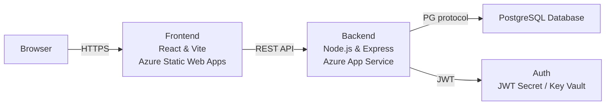
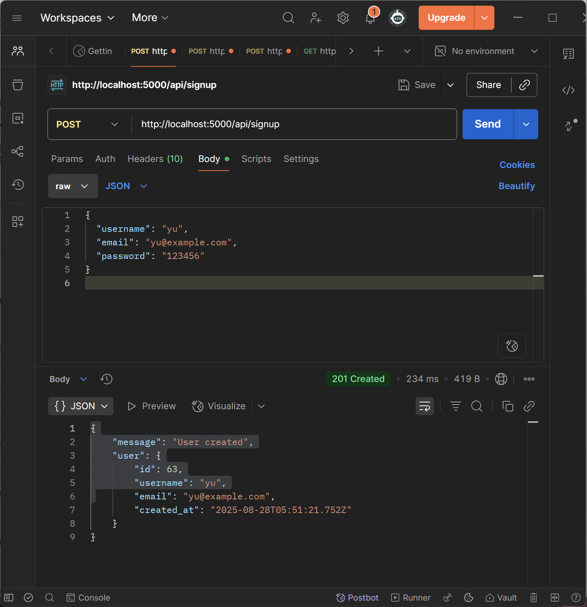
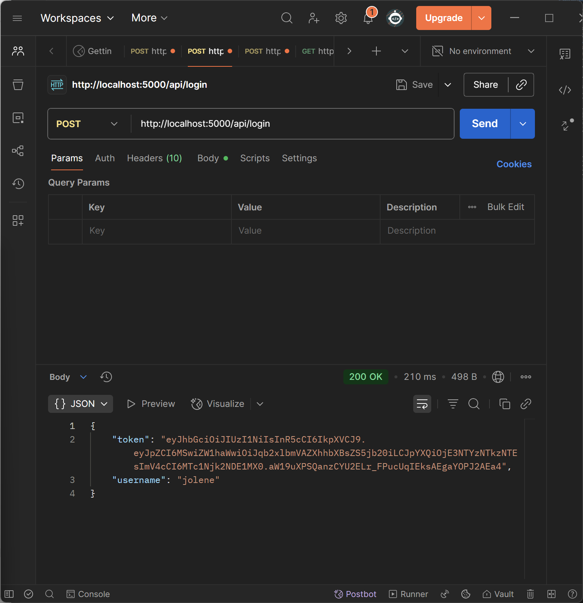
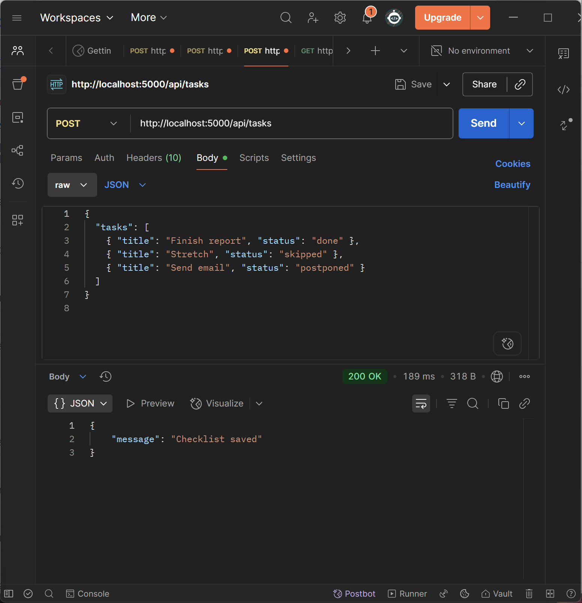
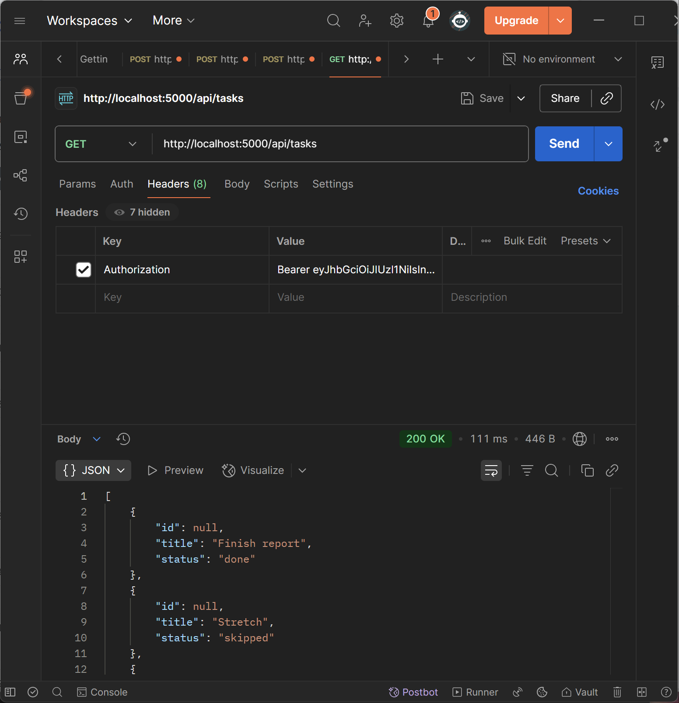

# 1. Production Support & Testing Scenarios

## Service Dependency Diagram



---

## Monitoring

### Component Health & Checks

| Component | Check | How to Run | Expected | Alert Threshold |
|---|---|---|---|---|
| Backend (App Service) | HTTP health | `GET /health` (Browser/Postman/cURL) | `200 OK` + `"Slotly running"` | 3 consecutive failures within 1 minute |
| Backend (process) | Port binding | App Service **Log stream** startup logs | Log contains `Listening on port 3000` | No log or repeated crash |
| Database | Connectivity | `SELECT 1;` / app startup logs | Successful return | > 3 failed connection attempts |
| Frontend (Static Web Apps) | Availability | Open homepage URL | Page loads without 5xx errors | 5xx or 404 |

### Logs & Where to Find

- **Local Backend**: VS Code terminal / `npm run dev` output  
- **Azure App Service (Backend)**: Portal → App Service → **Log stream**; file logs in `/LogFiles/` if enabled  
- **Azure Static Web Apps (Frontend)**: Portal → Static Web App → **Logs**  
- **Application Insights (Optional)**: Monitor **Failures / Live Metrics**, configure alert on failure rate > 5%  

### Health Check Endpoints / Commands

- Backend: `GET https://slotly01.azurewebsites.net/health`  
- Local: `curl -s -o /dev/null -w "%{http_code}\n" http://localhost:3000/health` (expect `200`)  

---

## Common Incidents & Recovery Steps

### Runbook: Database Connection Loss
**Symptoms**: 500 errors / `ECONNREFUSED`; backend logs show `failed to connect`  
**Diagnosis**  
1. Run `SELECT 1;` using DB client  
2. Verify backend env vars: `DB_HOST/DB_PORT/DB_USER/DB_DATABASE`  
3. For cloud DB: check firewall/IP whitelist, SSL settings (`PGSSLMODE`)  
**Resolution**: Fix env vars or whitelist → Restart App Service  
**Verification**: `GET /health` returns 200; Postman login + `GET /api/tasks` succeeds  

### Runbook: Service Crash / 503
**Symptoms**: Azure 503 “Application Error” page  
**Diagnosis**  
1. Check App Service **Log stream** for startup logs  
2. Verify usage of `app.listen(process.env.PORT)`; check for uncaught exceptions  
**Resolution**: Fix port/startup script, redeploy; enable `Always On` if needed  
**Verification**: `GET /health` returns 200; App Service **Browse** works  

### Runbook: CORS Block
**Symptoms**: Browser request blocked (OPTIONS preflight fails)  
**Resolution**:  
- Backend config:  
  ```js
  app.use(cors({
    origin: ["https://slotly01fe.z9.web.core.windows.net/"],
    credentials: true
  }));
  ```  
- Update to production domain after deployment  
**Verification**: Frontend can log in and fetch tasks (200/201)  

### Runbook: Auth/JWT Issues
**Symptoms**: 401/403 errors  
**Diagnosis**: Check `Authorization: Bearer <token>` header; token expiration; `JWT_SECRET` mismatch  
**Resolution**: Re-login to refresh token; ensure consistent env vars across services  
**Verification**: `POST /api/tasks` succeeds (201)  

---

## Testing Scenarios

### Unit Tests
- UT-Auth-Hash: `hashPassword("abc123")` → returns bcrypt hash (starts with `$2b$`)  
- UT-Auth-Verify: `verifyPassword("abc123", hash)` → true; wrong password → false  
- UT-JWT-Sign: `signToken({id:1})` → returns token  
- UT-JWT-Verify: `verifyToken(token)` → returns payload  

### Integration Tests
- IT-Signup-201: `POST /api/signup` with new email → 201 + user object  
- IT-Login-200: `POST /api/login` → 200 + JWT token  
- IT-Tasks-Create-201: With Bearer token → 201; `GET /api/tasks` returns created task  

### End-to-End Tests
1. Open frontend homepage  
2. As guest: add task → switch page → task persists (local storage)  
3. Signup + login → verify data sync  
4. Add event in Dashboard → calendar shows event with title/time  
5. Share link → Public mode shows titles; Private mode shows “busy” only  

---

## Manual Test Cases

| ID | Scenario         | Steps                  | Expected                  | Actual (fill in)               | Result |
|----|-----------------|------------------------|---------------------------|--------------------------------|--------|
| M1 | Guest tasks persist | Add → switch page   | Tasks remain             | Tasks remained after switching page | Pass   |
| M2 | Signup/Login    | Register & login       | JWT stored                | JWT returned, stored                | Pass   |
| M3 | Save Task       | Add task logged in     | Task saved                | Task returned in GET /tasks         | Pass   |
| M4 | Save Event      | Add 09:00–11:30 event  | Shows title+time          | Calendar shows correctly            | Pass   |
| M5 | Share Public    | Toggle Public → URL    | Titles visible            | Event title shown in incognito      | Pass   |
| M6 | Share Private   | Toggle Private → URL   | Busy only                 | Only busy blocks shown              | Pass   |
| M7 | Health          | GET /health            | 200 OK                    | 200 OK with “Slotly running”        | Pass   |

---

## Post-deployment Smoke Tests

1. **Backend health** → `GET https://slotly01.azurewebsites.net/health` = 200  
2. **Frontend loads** → Open `https://slotly01.azurestaticapps.net/` (no 5xx errors)  
3. **Signup** (new email) → 201  
4. **Login** → 200 + JWT token  
5. **Create Task** (with Authorization header) → 201  
6. **Get Tasks** → returns array with created task  
7. **Share link (Public/Private)** → open in incognito, content matches mode  

---

## Evidence (Screenshots)

**Signup**  


**Login**  


**Create Task**  


**Get Tasks**  

