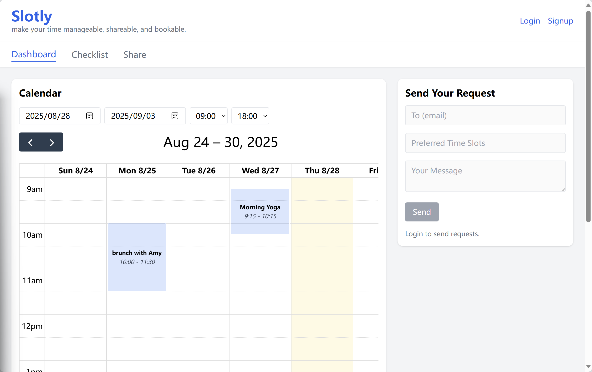
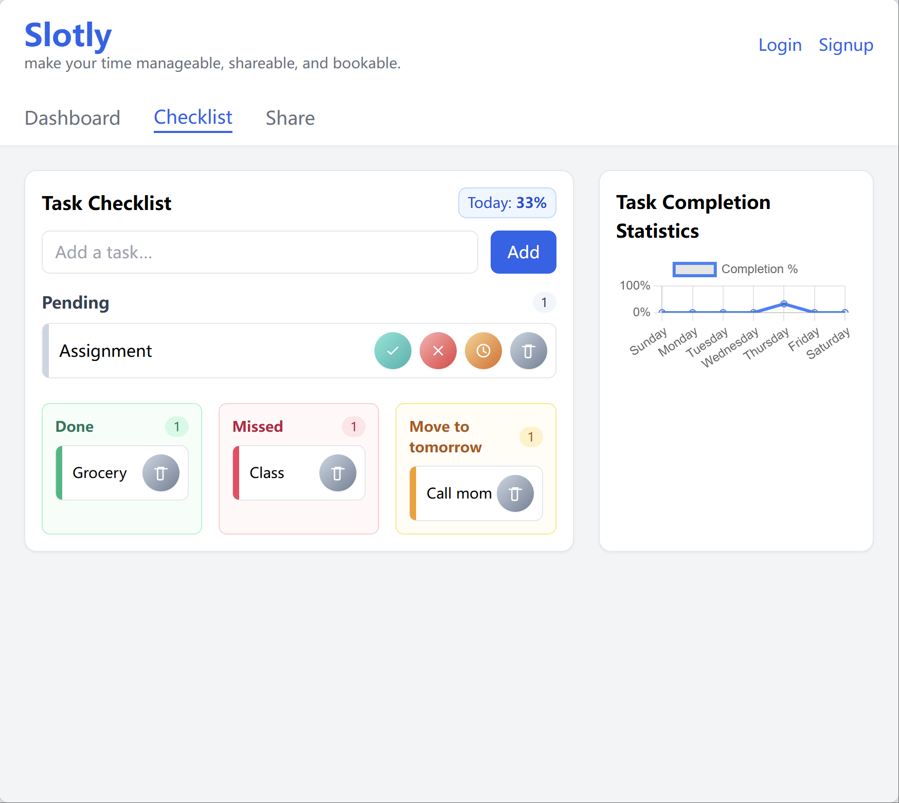
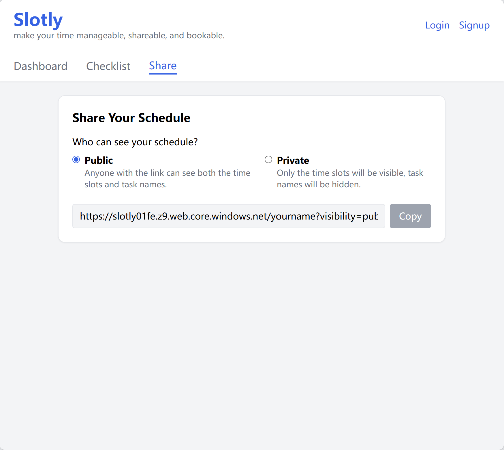

# 4. System Usage Guide

This section is for **end users** (non-developers).

---

## Accessing the App
- **Frontend URL**: https://slotly01fe.z9.web.core.windows.net  
- **Backend API**: https://slotly01.azurewebsites.net  
- **Test Account**: test@example.com / password123  

---

## Navigation
- **Dashboard**: calendar with events  
- **Checklist**: to-do tasks + weekly stats  
- **Share**: shareable link (Public/Private modes)  

---

## Workflows

### A. Signup + Login
1. Click Sign Up  
2. Enter email + password  
3. Log in, see username in header  

### B. Add Checklist Task
1. Go to Checklist  
2. Add new task → mark done/skipped/postponed  
3. See stats update  

### C. Add Event
1. Open Dashboard  
2. Drag time block → add title → Save  
3. See event appear  

### D. Share Calendar
1. Go to Share  
2. Select Public or Private  
3. Copy link, open in incognito  

---

## Limitations
- Guest mode not persistent  
- Share mode depends on Public/Private  
- Login required for saving data  

---

## Screenshots
- Dashboard view:   
- Checklist:   
- Share page: 
