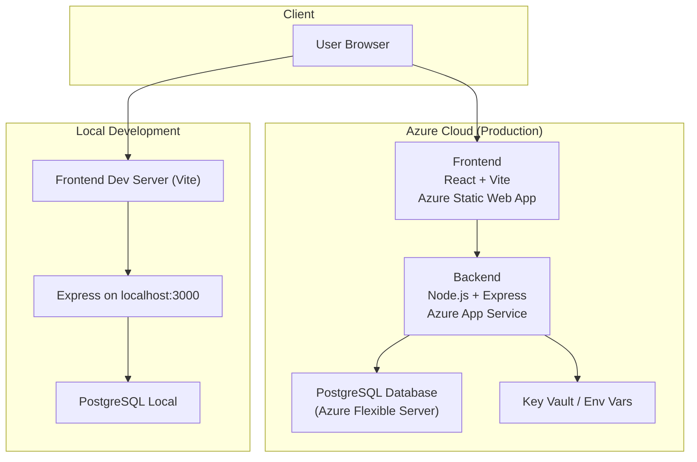

# 5. Architecture Diagram

---

- **Frontend**: React + Vite. Connects via `VITE_API_BASE_URL`  
- **Backend**: Node.js + Express, binds `process.env.PORT` in Azure App Service  
- **Database**: PostgreSQL (local in dev, Azure Flexible Server in production)  
- **Secrets**: Stored in `.env` locally or Azure Key Vault in production  
- **Health Check**: `/health` endpoint  
